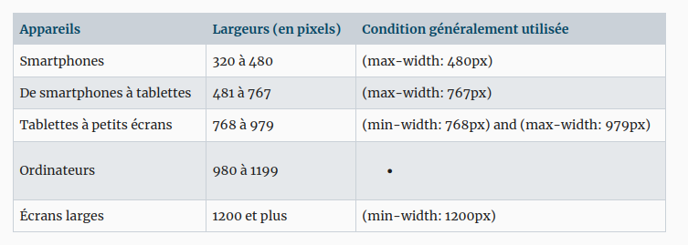

# lourenco

# Develop

sam. 25 févr. 2023 14:02:04 CET

# Existentia

Table of contents

- [Company](#company) 
- [Context](#context) 
- [Project](#project) 
  - [first page](#First-page)
  - [second page](#Second-page)
  - [third page](#third-page)
  - [fourth page](#fourth-page)
  - [fifth page](#fifth-page)
  -
- [Budget](#Budget) 
- [Deadline](#deadline) 

## Company

Name : Existentia SA

Address : 77 rua valentim Siti, Maputo

Contacts :

    • Agostinho Langa : +258 84 294 5714 ; Agostinho.langa@skyadvance.co.mz

    • Rodrigue Fezeu : +258 86 519 5821 ; fezeu.rodrigue@gmail.com

    • Venceslau : +258 85 076 0597 ; venceslau3000@hotmail.com

## Context

Story : The firm will offer many services to the high standing people or companies.

Company Turnover : None

Company Size : 3 FTE

Activity : Conciergerie’s Services

Market : B2B and B2C

Brand Positioning : High standing

## Project

Statut : First website creation

Purpose :

    • Interactive Website ;

    • Boarding gate to the people willing to discorver the country (or to live) ;

    • A website showing general informations with minimum of pages ;

    • Must have all pages just in scrowling up and down ;

    • Tools measuring the trafic, the time spent ;

    • Cookies & GDPR tools (The EU General Data Protection Regulation).

The website will be set up by :

    • Address Name : www.existentia.com

    • Languages : EN, FR, PR

    • Background color : Black and Grey

## Pages

### First page 

: Introduction Page with a caroussel of 2 or 3 interactives pictures (if possible) : Maputo, Vilankulous / informations about our services / Package services & Rates ;

### Second page 

: Informations about the Country (Pictures and Texts) ;

### Third page

: Services (Home services ; Familly ; Mobility and Car ; In the country ; leisures ; etc)

### Fourth Page 

: Packages :

Pack Serenity : 6/7 – 7h/21h – 180 000 MT

Pack Elite : 7/7 - 7h/21h – 250 000 MT

Pack Experience : To plan

### Fifth page

Fifth page : Contact / Map / FAQ (Frequently Asked Question).

Email : contact@existentia.com

## Exemples of websites

Exemples of websites : www.jhonpaul.com ; www.premium-conciergerie.com ; www.signareconciergerie.com

The website must include analytic’s tools

A whatsapp feature included in any pages

## Budget

The budget cannot be over the 1000 €.

## Deadline
The outcome will determinate the deadline

## ressources

### sites example

[jhonpaul](www.jhonpaul.com) dead link
[premium-conciergerie](www.premium-conciergerie.com)
[signareconciergerie](www.signareconciergerie.com)

[json formatter](https://jsonformatter.curiousconcept.com/#)
[!! mauvaus JSON Editor Online](https://www.jsoneditoronline.org/)
[Json viewer](jsonviewer.stack.hu)

[ressource-card](https://resourcecards.com/)

## add react-responsive
   
   

lun. 06 mars 2023 08:19:48 CET
/home/arfmazad/Documents/dev/dalat
   
lun. 06 mars 2023 21:14:10 CET
/home/arfmazad/Documents/dev/fireBase-todolist
   
lun. 06 mars 2023 22:38:36 CET
/home/arfmazad/Documents/dev/fireBase-todolist
   
lun. 06 mars 2023 23:06:41 CET
/home/arfmazad/Documents/dev/fireBase-todolist
   
mar. 07 mars 2023 08:10:35 CET
/home/arfmazad
   
mar. 07 mars 2023 17:56:41 CET
/home/arfmazad/Documents/dev/fireBase-todolist
   
mar. 07 mars 2023 17:56:46 CET
/home/arfmazad/Documents/dev/fireBase-todolist
   
mar. 07 mars 2023 18:36:37 CET
/home/arfmazad/Documents/dev/fireBase-todolist
   
mar. 07 mars 2023 18:59:25 CET
/home/arfmazad/Documents/dev/fireBase-todolist
   
mer. 08 mars 2023 11:31:45 CET
/home/arfmazad/Documents/dev/fireBase-todolist
   
mer. 08 mars 2023 11:31:49 CET
/home/arfmazad/Documents/dev/fireBase-todolist
   
mer. 08 mars 2023 13:10:50 CET
/home/arfmazad/Documents/dev/fireBase-todolist
   
mer. 08 mars 2023 19:38:00 CET
/home/arfmazad/Documents/dev/fireBase-todolist
   
mer. 08 mars 2023 22:49:46 CET
/home/arfmazad/Documents/dev/fireBase-todolist
   
mer. 08 mars 2023 23:29:56 CET
/home/arfmazad/Documents/dev/fireBase-todolist
   
jeu. 09 mars 2023 01:00:41 CET
/home/arfmazad/Documents/dev/fireBase-todolist
   
jeu. 09 mars 2023 22:45:14 CET
/home/arfmazad/Documents/dev/fireBase-todolist
   
jeu. 09 mars 2023 23:12:17 CET
/home/arfmazad/Documents/dev/fireBase-todolist
   
ven. 10 mars 2023 08:16:14 CET
/home/arfmazad/Documents/dev/fireBase-todolist
   
ven. 10 mars 2023 17:10:30 CET
/home/arfmazad/Documents/dev/fireBase-todolist
   
